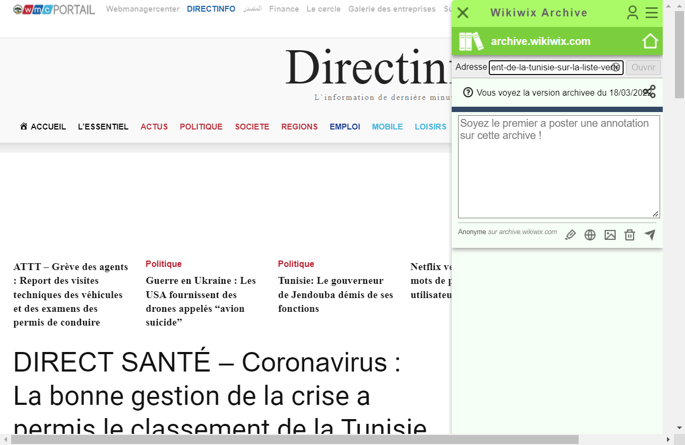

# Random Wikipedia walker

Using Selenium, create a small program that, starting from the main page https://www.wikipedia.org/, walks trough a sequence of random links and takes a snapshot of the last page.
The process is as follows:

 1. Navigate to the main page https://www.wikipedia.org/
 2. Select a random link in the page
 3. Navigate to the link
 4. Repeat steps 2 to 3 until you have visited 10 different pages
 5. Take a snapshot of the current page and save it

Include the code of the walker and the snapshot in this document.

## Answer
 ````java
import io.github.bonigarcia.wdm.WebDriverManager;
import org.apache.commons.io.FileUtils;
import org.junit.jupiter.api.AfterEach;
import org.junit.jupiter.api.BeforeEach;
import org.junit.jupiter.api.Test;
import org.openqa.selenium.*;
import org.openqa.selenium.chrome.ChromeDriver;

import java.io.File;
import java.io.IOException;
import java.util.*;

public class TestWiki {

    private WebDriver webDriver;
    private ArrayList<String> listVisitedUrls;
    private String urlTovisit;

    @BeforeEach
    public void setUp(){
        listVisitedUrls = new ArrayList<String>();
        urlTovisit = "";
        WebDriverManager.chromedriver().setup();
        webDriver = new ChromeDriver();
    }
    @AfterEach
    public void tearDown(){
        webDriver.quit();
    }

    @Test
    public void testNav10Links(){
        urlTovisit = "https://fr.wikipedia.org/";
        webDriver.navigate().to(urlTovisit);

        // Random number
        Random rand = new Random();

        while (listVisitedUrls.size() < 10){
            try{
                //get all the links in DOM
                List<WebElement> linksList = webDriver.findElements(By.tagName("a"));
                if(linksList.size()>0){
                    //random btw 0 and size
                    int index = rand.nextInt(linksList.size() + 1);
                    WebElement randomLink = linksList.get(index);
                    String url = randomLink.getAttribute("href");
                    randomLink.click();
                    listVisitedUrls.add(url);
                }
            }catch(ElementNotInteractableException e){
            }
        }

        //Screenshot
        File scrFile = ((TakesScreenshot)webDriver).getScreenshotAs(OutputType.FILE);
        try {
            FileUtils.copyFile(scrFile, new File("C:\\Users\\ethomas\\IdeaProjects\\demo\\src\\test\\java\\com\\example\\demoscreenshot.png"));
        } catch (IOException e) {
            e.printStackTrace();
        }
    }
}

````


